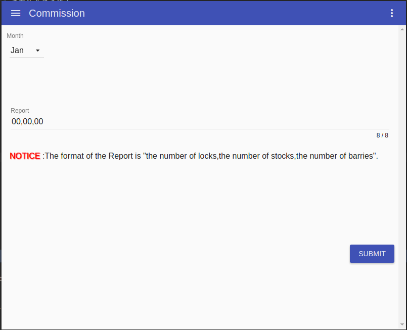
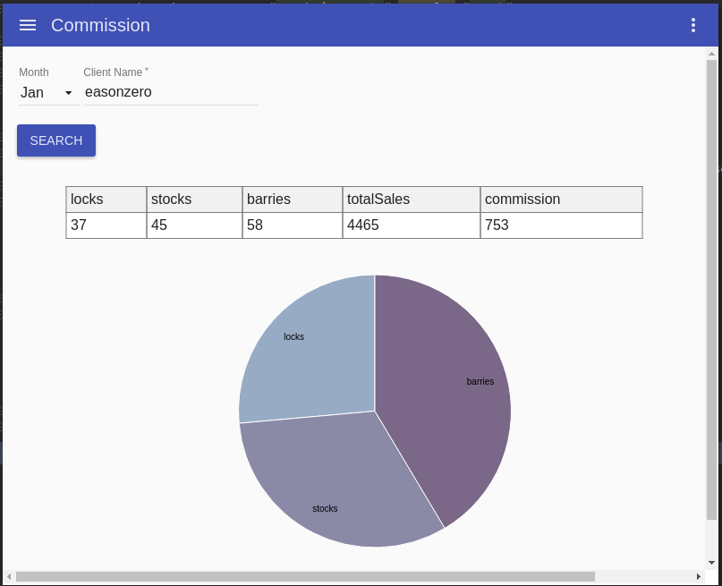
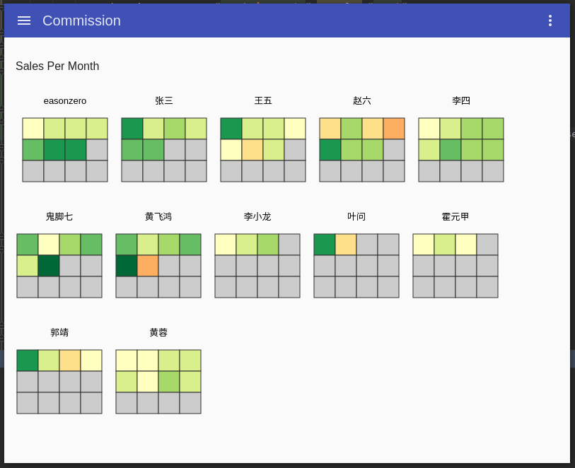
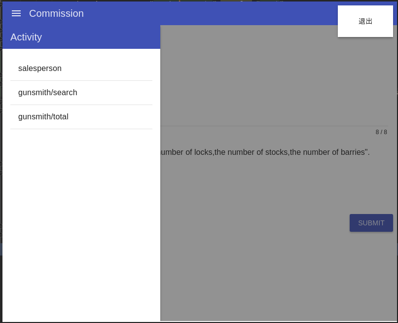
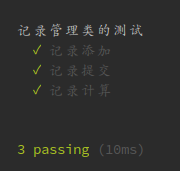

# Commission
哈工大软件测试大作业3，基于electron、angular构建的material风格的桌面app，图表绘制使用d3.js，测试框架使用macha

作业的题目是军火商和供应商的py交易,功能上支持多用户、多月份、非连续输入的py交易,图表目前支持单用户销售量的饼图和多用户销售额小绿点图(类似github那个小绿点)

# 还有什么好说的！
# 学弟学妹们快上车，随便拿去用！

##运行

运行需要自行搭建node环境和npm，全局安装好electron。下面展示linux下如何使用：

>sudo apt-get install nodejs(node其实不建议这么安装，建议到官网下载)  
sudo apt-get install npm  
sudo npm install electron -g  

如上环境就算都弄好了，现在展示如何运行项目：

>electron .

##测试

测试需要安装测试框架mocha,和断言库should

>sudo npm install mocha -g  
sudo npm install --only=dev

测试文件在`./test`,在根目录使用测试命令

>mocha

测试结果如下

