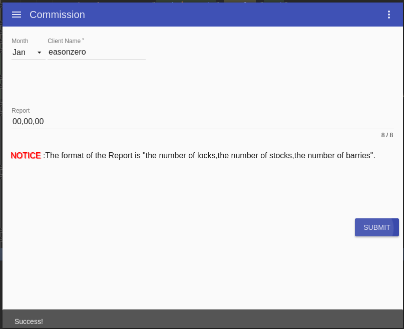

# Commission
哈工大软件测试大作业3，基于electron、angular构建的material风格的桌面app，图表绘制使用d3.js，测试框架使用macha

作业的题目是军火商和供应商的py交易

# 还有什么好说的！
# 学弟学妹们快上车，随便拿去用！

##运行

运行需要自行搭建node环境和npm，全局安装好electron。下面展示linux下如何使用：

>sudo apt-get install nodejs(node其实不建议这么安装，建议到官网下载)
sudo apt-get install npm
sudo npm install electron -g

如上环境就算都弄好了，现在展示如何运行项目：

>electron .

